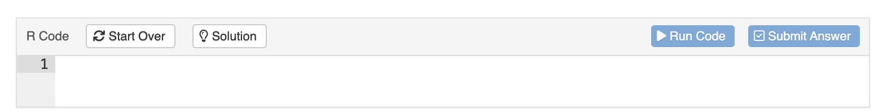

<link rel="stylesheet" type="text/css" href="https://rsacdn.link/teachthis/css/style.css"/>

```{r setup, include=FALSE}
library(learnr)
library(tidyverse)
library(arthistory)
library(ggplot2)
library(ggcheck)
library(gt)

#library(here)
library(gradethis)
knitr::opts_chunk$set(echo = FALSE, exercise.checker = gradethis::grade_learnr)
theme_set(theme_light())

# small data set to use throughout the tutorial
set.seed(100)
worksgardner_sample <- worksgardner %>%
 count(publication_year, artist_race,  artist_gender) %>%
 select(publication_year, artist_race,  artist_gender,n) %>%
 rename(number_of_artworks = n)

set.seed(333)
a <- abs(rnorm(n = 10) * 10)
b <- a + rnorm(n = 10)

flair_bg_blue <- "#C2D8EE"
flair_bg_green <- "#DFF0D8"


```

## Introduction

### Welcome BWD Summit 2024!

### Pre-Survey WorkShop Intake Form

If everyone can scan this QR code and fill out the survey

{width="140"}

### Tutorial Overview

This tutorial will introduce you to the fundamentals of **R language** and the Tidyverse, a powerful collection of R packages for data manipulation and visualization.

Participants will gain hands-on experience selecting and filtering data, creating new variables, and visualizing trends in the dataset. By the end of the session, they will have built several visualizations, including bar plots and line graphs, highlighting the contributions of Black women artists featured in art history textbooks.

You don’t need to know anything about R before you begin. The tutorial is designed to be the ideal starting place for new R users.

**Objectives:**

-   Teach the basics of running R code.

-   Introduce the tidyverse, focusing on `dplyr` for data manipulation.

-   Demonstrate how to create visualizations using `ggplot2`.

-   Explore the representation of Black women artists using the `worksgardner` dataset.

### Agenda

**Welcome to R:**

1.  **What is R?** (30 minutes)

    -   Write and run R code

    -   Run functions on values

    -   Save values as objects to use later with `<-`

    -   Chain functions together with `|>`

    -   The basics of R packages

**Introduction to the Tidyverse**:

2.  **Data Manipulation with dplyr** (30 minutes)

    -   Selecting columns with `select()`.

    -   Filtering rows with `filter()`.

    -   Arranging data with `arrange()`.

    -   Creating new columns with `mutate()`.

3.  **Data Visualization with ggplot2** (30 minutes)

    -   Creating basic visualizations.

    -   Customizing plots.

    -   Visualizing trends in the data.

    -   Highlighting Black women artists.

## Logistics

**Before we begin**

Throughout this tutorial, you will see code exercises that look like this:



-   When you click **Run Code**, the box will send what you wrote to an R interpreter. That’s a program that can read and run R code. The interpreter will print the result of your code below the box.

-   When you click **Submit Answer**, it will provide feedback on your code. There is no answer being submitted, and I am not grading your submission. **Submit Answer** is a way to learn new things, like how to fix your code when it is not working

-   When you click **Solution**, it will give you the answer - as tempting as it may be - try to figure it out first before clicking on it.

## **Welcome to R**

### **What is R?**

R is a powerful and flexible programming language and software environment specifically designed for statistical computing and data analysis.R is open-source, meaning that it is free to use and has a large community contributing to its ongoing development.

### **How to Install R?**

To get started with R, follow these steps to install it on your computer:

Download R:Visit the Comprehensive R Archive Network (CRAN): <https://cran.r-project.org/>. Choose your operating system (Windows, MacOS, or Linux) and download the appropriate installer.

Install R: Run the downloaded installer and follow the installation instructions.

Install RStudio on your desktop using the following link: <https://posit.co/download/rstudio-desktop/>

Once R is installed, you can start using it to run analyses and visualizations. R has a wide variety of packages available to extend its functionality. Here’s how to install and load some basic R packages:

### **The basics of R packages**

#### Installing Packages:

To install a package in R, use the `install.packages()` function.

For example, you can install the ggplot2 package for data visualization and the dplyr package for data manipulation:

`install.packages("ggplot2")`

`install.packages("dplyr")`

-   The packages needed for this tutorial has already been installed.

#### Loading Packages:

After a package is installed, you need to load it into your R session using the library() function. This needs to be done each time you start a new session and want to use the package:

Example

```{r ex2-print, exercise=TRUE}
library(ggplot2)  
library(dplyr)     
```

Conclusion: With R installed and basic packages loaded, you're ready to start performing data analysis and visualizations. R offers extensive resources and community support, making it a great choice for anyone looking to work in data science or statistics. Happy coding!

### Write and run R code

```{r}
print("Jimmy - can you go back and add %>%, ?,  <- and |>, and then talk about what a data frame/tibble is.")
# Jimmy. - can you talk about what a %>% and <- is in this section.
#    -   Run functions on values

#    -   Save values as objects to use later with `<-`

#    -   Chain functions together with `|>` or with %>%
```

Now Let's try a simple exercise of creating a school data frame using a tibble format A Tibble is a data frame that is part of the tidyverse library.

```{r ex3-print, exercise=TRUE}
#We want to create a data frame to keep track of:

#The teachers at Grove Middle School
#The number of students in their classrooms
#The grade levels of the students
#We begin by loading the tibble package which contains tibble(). Next we input our data into tibble(). Our tibble will have the column names teacher, class_size, and grade with the values provided below.

library(tibble)
tibble(
  teacher = c("Gaines", "Johnson", "Hernandez"),
  class_size = c(30, 26, 28),
  grade = c(6, 7, 8)
)
## # A tibble: 3 × 3
##   teacher   class_size grade
##   <chr>          <dbl> <dbl>
## 1 Gaines            30     6
## 2 Johnson           26     7
## 3 Hernandez         28     8
#After checking out the created tibble, we realize it would be a good idea to include the school name in the data frame in case we decide to include other schools in the future. If we pass only a single value to this column, R will use its recycling rules to reuse that value for each row in the tibble.

tibble(
  teacher = c("Gaines", "Johnson", "Hernandez"),
  class_size = c(30, 26, 28),
  grade = c(6, 7, 8),
  school = "Grove MS"
)
## # A tibble: 3 × 4
##   teacher   class_size grade school  
##   <chr>          <dbl> <dbl> <chr>   
## 1 Gaines            30     6 Grove MS
## 2 Johnson           26     7 Grove MS
## 3 Hernandez         28     8 Grove MS
#Lastly, we assign the created tibble to the object, teachers, so we can access is later.

teachers <- tibble(
  teacher = c("Gaines", "Johnson", "Hernandez"),
  class_size = c(30, 26, 28),
  grade = c(6, 7, 8),
  school = "Grove MS"
)
```

Congrats on your completing your into to R coding. Now lets dive into the Tidyverse World :)

## **Introduction to Tidyverse**

{width="124"}

### Overview

The `tidyverse` is a [**collection of R packages**](https://www.tidyverse.org/packages) designed for data science. All packages share an underlying design philosophy, grammar, and data structures. It includes packages like **ggplot2** for visualization, **dplyr (**pronounced **DEE-ply-er)** for data manipulation, and **tidyr** for data tidying.

As of [tidyverse 2.0.0](https://www.tidyverse.org/blog/2023/03/tidyverse-2-0-0/), the core tidyverse includes nine packages:

-   **ggplot2**
-   **dplyr**
-   tidyr
-   readr
-   purrr
-   tibble
-   stringr
-   forcats
-   lubridate

### Installation and use

-   Install all the packages in the tidyverse by running `install.packages("tidyverse")`.

-   Run `library(tidyverse)` to load the core tidyverse and make it available in your current R session.

## **Data transformation with dplyr**

{width="71" height="81"}

Now it's time to explore your data and get some initial insight into the dataset.

You'll be using four dplyr *verbs* to explore and tranform a dataset.

The four verbs are `select()`, `filter()`, `arrange()` and `mutate()`, which do exactly what they say.

By the end of this section, you'll be comfortable using these verbs in various combinations.

## **Explore Data**

Art history textbooks may be filled with art, but women artists frequently occupy less space. The insights we can gain from data are profound, revealing truths that often go unnoticed.

+--------------------------------------------+------------------------------------------------------------------------------------------+
| {width="85%"} | #### **"I paint what I am. I am a black woman, and I am proud of being a black woman."** |
|                                            |                                                                                          |
|                                            | #### **- Faith Ringgold**                                                                |
+--------------------------------------------+------------------------------------------------------------------------------------------+

### **Source Data**

We are going to take a look at the physical space each artwork is given across many editions of some of the most important art history textbooks.

Artists who are women have been historically underrepresented, both where art is displayed and where it is studied like textbooks, and this dataset lets us understand more about in what ways this is true.

The [dataset](https://saralemus7.github.io/arthistory/#datasets) used in this tutorial was created by Holland Stam for her excellent undergraduate [thesis](https://doi.org/10.7924/r4dn48h0w). Let’s start by reading in the data for one specific textbook, ***Gardner’s Art Through the Ages***:

**Can you load the `arthistory` package below?** I’ve already installed the package for us.

```{r library-tidyverse-arthistory, exercise=TRUE}


```

```{r library-tidyverse-arthistory-solution}
library(arthistory)
```

```{r library-tidyverse-arthistory-check}
grade_code("The arthistory package contains 3 datasets: worksjanson, worksgardner, and artists.")
```

**Use the code box below to display `worksgardner`.**

```{r data-explore-arthistory, exercise=TRUE}
worksgardner

```

```{r data-explore-arthistory-solution}
# explore the worksgardner artwork data
worksgardner
```

```{r data-explore-arthistory-check}
grade_code("The data and glimpse function allows us to preview the data.")
```

## **Select Data**

### **Select, rename, and reorder columns**

This section will focus on dplyr’s `select()` function, which lets us select columns from a table. You will:

1.  Narrow a data set to only the columns that interest you
2.  Use selection helpers to select columns more easily
3.  Rename and reorder columns

#### **Select a subset of columns**

Lets take a look at the same data set again, but this time lets run `glimpse()`.

```{r ex-select-column, exercise=TRUE}
glimpse(worksgardner)

```

##### **`select()`**

**Fill in the blank code below with `select()` to select four columns from `worksgardner`.**

```{r dplyr-arthistory-select-1, exercise=TRUE}
worksgardner %>%
  ____(artist_name, artist_gender, artist_race, publication_year)
```

```{r dplyr-arthistory-select-1-solution}
# filter the data by "artist_race" that is "Black or African American"
worksgardner %>%
 select(artist_name, artist_gender, artist_race, publication_year) 
```

```{r dplyr-arthistory-select-1-check}
grade_code("select() extracts a subset of columns")
```

### **Takeaway** {.takeaway}

-   You can use the `select()` function from dplyr to subset columns from a data frame by name with the pattern:

    ```{r, eval = FALSE, echo = TRUE}
    <DATA SET> %>%
      select(<COLUMN1>, <COLUMN2>)
    ```

-   To select a column whose name looks like

    -   a number, `2012`,
    -   a mathematical expression, `A-1`,
    -   or two object names, `Art Work`,

    we need to wrap it in backticks when we refer to it in `select()`. This prevents R from misinterpreting the column name, e.g.

    ```{r eval = FALSE,echo=TRUE}
    select(worksgardner, `Art Work`)
    ```

### 

We can select columns in other ways as well. Consider the code below. What do you think it does?

```{r contains, eval = FALSE, echo=TRUE}
worksgardner %>%
  select(contains("artist")) 
```

::: {#divSelectContains style="background-color: #f0f0f0; padding: 10px; border-radius: 5px;"}
`contains()` is one of several selection helpers that we can use inside of `select()` to specify which columns to select. Helper functions and operators make it easy to select many columns at once.
:::

Let's try to find all columns that contains the word artist.

```{r dplyr-arthistory-select-2, exercise=TRUE}
worksgardner %>%
  select(contains("artist")) 
```

#### **Takeaway** {.takeaway}

We use `select()` and its helper functions to subset specific columns in a table in elegant ways. We can make smart selections by mix-and-matching helper functions with each other and with boolean operators. To learn more, visit the [tidyselect helper documentation](https://tidyselect.r-lib.org/reference/language.html){target="_blank" rel="noopener noreferrer"}.

<!-- this table is useful for the takeaway but also too big for the takeaway -->

```{r, echo = FALSE}
helpers <- tibble::tribble(
~" ",               ~type,              ~Selects,                                              ~Example,

"`-`",             "Selection helper", "Every column except",                                   "`select(worksgardner, -book)`",
"`:`",             "Selection helper", "Every column between (inclusive)",                        "`select(worksgardner, artist_name:artist_race)`",
"`contains()`",    "Selection helper" , 'Columns whose name contains a string', '`select(worksgardner, contains("artist"))`',
"`starts_with()`", "Selection helper" , 'Columns whose name starts with a string', '`select(worksgardner, starts_with("a"))`',
"`ends_with()`",     "Selection helper", 'Columns whose name ends with a string', '`select(worksgardner, ends_with("(book)"))`',
"`matches()`",     "Selection helper", 'Columns whose name contains a string that matches a regular expression' , '`select(worksgardner, matches("\\d"))` (i.e. match names containing a digit)',
"`last_col()`",   "Selection helper", 'Select last column, possibly with an offset', '`select(worksgardner, last_col())` <br> <br> `select(worksgardner, last_col(offset = 2))` (selects the penultimate column)',
"`any_of()`",      "Selection helper"     , "Columns whose names appear in the given set; does not check for missing columns", '`select(worksgardner, any_of(c("height", "total")))`',
"`all_of()`",        "Selection helper"     , 'Columns whose names appear in the given set; gives an error if any are missing', '`select(worksgardner, all_of(c("artist", "book")))`',
"`num_range()`", "Selection helper"   , 'Columns whose name ends with a numerical suffix in the range (i.e. "x01", "x02", "x03")', "Not applicable with `worksgardner`",
"`&`", "Boolean operator", "And", '`select(worksgardner, starts_with("a") & -contains(" "))`',
"`|`", "Boolean operator", "Or", '`select(worksgardner, ends_with("(book)") | ends_with("(t)"))`',
"`!`", "Boolean operator", "Opposite of", '`select(worksgardner, !ends_with("(book)")`'
)

helpers %>%
  gt::gt(
    id = "helpers",
    groupname_col = "type"
  ) %>%
  gt::fmt_markdown(columns = everything()) %>%
  gt::tab_style(
    style = gt::cell_borders(sides = "left", color = "#D3D3D3", weight = "2px"),
    locations = gt::cells_body("Selects")
  ) %>% 
  gt::tab_style(
    style = gt::cell_borders(sides = "right", color = "#e3e3e3", weight = "2px"),
    locations = gt::cells_body("Selects")
  ) %>% 
  gt::tab_options(
    row_group.font.weight = "bold"
  ) #%>%
  # cols_width(
  #  Selects ~ gt::px(100),
  #  Example ~ gt::px(50)
  # )

```

##### **Combining helpers**

Recall that you learned how to use boolean operators to write logical tests. To build very specific selection criteria, we can mix and match our selection helper functions with boolean operators.

-   *and* (`&`)

-   *or* (`|`)

-   *opposite of* (`!`)

-   *excluding* (`-`)

Consider the code below.

```         
worksgardner %>%
  select(starts_with("artist") & -contains(" "))
```

### **Rename columns**

There’s another useful way to use `select()`. **Run the code and see.**

```{r dplyr-arthistory-select-4, exercise=TRUE}
worksgardner %>%
  select(`Artist Name` = artist_name)
```

##### **`rename()`**

If you only need to rename columns without subsetting them from the data set, it is preferable to use dplyr’s rename() function instead.

Run the code below which uses rename(). What is the difference between using rename() or select()?

```{r dplyr-arthistory-select-5, exercise=TRUE}
worksgardner %>%
  rename(`Artist Name` =  artist_name)
```

### **Relocate**

`relocate()` is used to reorder columns in your data frame. By default it puts whatever columns you list at the front of your data set.

**Let's try to relocate artist_gender and artist_race as the first two columns in the window below.**

```{r dplyr-arthistory-select-6, exercise=TRUE}
worksgardner %>%
  relocate('___','___')
```

```{r dplyr-arthistory-select-6-solution}
# relocate "artist_race" that is "Black or African American"
worksgardner %>%
relocate('artist_gender','artist_race')
```

```{r dplyr-arthistory-select-6-check}
grade_code("relocate() reorder the columns in your data frame.")
```

You can determine where to relocate the columns with the optional arguments `.before` or `.after`.

```{r dplyr-arthistory-select-7, exercise=TRUE}
worksgardner %>%
  relocate(artist_gender,artist_race, .after = artist_name)

```

### **Takeaway** {.takeaway}

-   To select and rename columns in single step, use `select(<NEW NAME> = <OLD NAME>)`
-   To rename existing columns without dropping the rest of the columns in the data set, use `rename(<NEW NAME> = <OLD NAME>)`
-   To reorder columns use `relocate()`. Use the arguments `.before` or `.after` to specify where columns should be relocated.

## **Filter Data**

### **Filter rows from a table**

In this section you will subset rows from a data set. Specifically, you will learn how to:

1.  Subset a table to just the rows that interest you with `filter()`

2.  Write logical tests within `filter()` to determine which rows to return

3.  Combine multiple tests into a single filter with Boolean operators

4.  Learn to work with missing values when filtering

Let's say that you wanted to choose a particular set of observations, i.e. - those for which the "artist_race" was 'Black or African American'. dplyr allows us to do intuitively and in a language that mirrors how you think and talk about data.

You can use `filter()` from the dplyr package to return only rows where artist_race corresponds to "Black or African American".

**Fill in the blank with filter() below**.

```{r dplyr-arthistory-filter, exercise=TRUE}
# filter the data by "artist_race" that is "Black or African American"
worksgardner %>%
  ___(artist_race == "Black or African American")
```

```{r dplyr-arthistory-filter-solution}
# filter the data by "artist_race" that is "Black or African American"
worksgardner %>%
filter(artist_race  == "Black or African American") 
```

```{r dplyr-arthistory-filter-check}
grade_code("filter() extract observations based on conditions. To combine multiple conditions, just separate those conditions with a comma")
```

### **Using `filter()`**

`filter()` needs two things to do its job:

::: {#filterblock style="background-color: #f0f0f0; padding: 10px; border-radius: 5px;"}
worksgardner %\>%

filter(artist_race == "Black or African American)
:::

1.  A data set to filter (this is often supplied by the forward-pipe operator, but it doesn’t have to be).

2.  A logical test to use as filtering criteria. Within that test, we can refer to columns in the data set by name.

`filter()` will return every row in the data set where the result of the logical test is `TRUE`.

Try it below. **Use `filter()` to find the rows in `worksgardner` where the `artist_gender` is a `Female`.**

```{r dplyr-arthistory-filter-2, exercise=TRUE}

```

```{r dplyr-arthistory-filter-2-solution}
# filter the data by "artist_race" that is "Black or African American"
worksgardner %>%
filter(artist_gender  == "Female") 
```

```{r dplyr-arthistory-filter-2-check}
grade_code("filter() extract observations based on conditions. To combine multiple conditions, just separate those conditions with a comma")
```

### **Takeaway** {.takeaway}

You can use `filter()` to find and return specific rows from a data frame, with the following syntax:

```{r syntax-show, eval = FALSE, echo=TRUE}
filter(<DATA SET>, <LOGICAL TEST>)
```

-   Using dplyr functions does not modify the original data set. To save your results, you must assign your table to a new R object.

-   Avoid common mistakes when writing logical tests with `filter()`:

    1.  **Do not** use `=` instead of `==` to test for equality

    2.  **Do not** forget to surround strings with quotation marks. Write `artist_gender == "Female"`, instead of `artist_gender == Female`.

::: fyi
Like all dplyr functions, you don't have to use the forward-pipe operator to supply the first argument:

```{r dplyr-filter-solution-no-pipe, eval = FALSE, echo=TRUE}
filter(worksgardner, artist_gender == "Female")
```
:::

## **Arrange Data**

### Arranging data with `arrange()`

What year did black women artwork get featured in the Gardner textbook?

We can use the `arrange()` function from the dplyr package to find out. **Run the code below.**

```{r arr, exercise = TRUE}
worksgardner %>% 
  filter(artist_gender == "Female", artist_race == "Black or African American") %>% 
  arrange(publication_year)
```

```{r aq3, echo = FALSE}
learnr::question(
  "What does `arrange()` do?",
  answer("`arrange()` sorts the rows according to the values of a column.", correct = TRUE),
  answer("`arrange()` moves a column to the right-hand side of the data set."),
  answer("`arrange()` moves a column to the left-hand side of data set."),
  allow_retry = TRUE
)
```

### **`desc()`**

To arrange rows from highest value to lowest (*descending* order), surround a column name with `desc()`. Like `arrange()`, `desc()` comes with the dplyr package.

For example, which countries had the *highest* `gdpPercap` in 2020?

We can use `arrange()` and `desc()` to sort any type of column in R. For example, we can sort a character column. `arrange()` and `desc()` will sort the column in alphabetical order. `desc()` will change this to reverse alphabetical order.

**Use `arrange()` and `desc()` to create this table.**

```{r echo = FALSE}
worksgardner %>% 
  filter(artist_gender == "Female") %>% 
  arrange(publication_year, desc(artist_race))
```

```{r test, exercise = TRUE}

```

```{r test-solution}

```

```{r test-check}

```

### **Takeaways** {.takeaway}

Use `desc()` inside `arrange()` to arrange by a variable in descending order. For example, the following code would arrange `worksgardner` by descending `publication_year`:

```{r eval=FALSE, echo=TRUE}
worksgardner %>% 
  arrange(desc(publication_year))
```

## **Mutate Data**

### **Create new columns**

In this lesson you will create and modify the columns in a table using the `mutate()` function from the dplyr package. `mutate()` is one of the most useful functions to have in your data science toolkit.

Specifically, you will learn how to:

1.  Add new columns

2.  Update existing columns

### **Add a new column**

Consider a small data set I’ve prepared called `penguins_sample`. It has four columns.

```{r}
worksgardner_sample
```

We want to add a fifth column called `researcher` that displays the last name of the person who collected each measurement. The last names are stored in the following vector:

```{r lastnames}
artist_lastnames <- c("Gorman", "Williams", "Gorman", "Williams", "Fraser")
```

We can use dplyr’s `mutate()` function to add new columns. Try it—**fill in the blank with `mutate()` to add the `researcher` column.**

```{r ex-mutate-data, exercise=TRUE}
worksgardner_sample %>%
  ____(researcher = artist_lastnames)
```

### **Syntax**

Whenever we use `mutate()`, we follow a specific pattern to create a new column:

```         
<data set> %>%
  mutate(<new_column> = <contents of new column>)
```

We supply:

-   **data set**: the name of the data set you are starting with is always the first argument of `mutate()`. This is often supplied using the forward-pipe operator.

-   **name of the new column**: this is `researcher` in the previous example.

-   **contents of the new column**: this is the vector `lastnames` in our example. It contains one value for each row in `penguins_sample`, and the values are ordered in the same order as the rows in `penguins_sample`.

Here is our code again:

```         
lastnames <- c("Gorman", "Williams", "Gorman", "Williams", "Fraser")

penguins_sample %>%
  mutate(researcher = lastnames)
```

{width="43" height="128"} You can also use `mutate()` without the forward pipe operator:

```         
mutate(<data set>, <new_column> = <contents of new column>)
```

**Add a new column called `body_mass_kg` to the data set `penguins_sample`. The new column should contain the values in the vector `kilograms`, shown below:**

```         
kilograms <- c(4.85, 3.20, 4.90, 3.45, 3.85)
```

If we’d like to retain a copy of `mutate()`’s output to use later, we should save the output as an object.

**Save the results of the call below to a new tibble called `penguins_sample_kg`** using R’s assignment operator `<-`.

penguins_sample %\>% mutate(body_mass_kg = kilograms)

We can use vectorized operations within `mutate()` to generate values for the new column on the spot. Here’s an example, with a larger data set called `worksgardner_page_size`.

```         
#worksgardner_page_size
```

Let’s create a new column named `body_mass_kg` that takes the values in the `body_mass` column and converts them to kilograms. **Complete the `mutate()` call below by filling in the blank with `body_mass / 1000`.** Your results will be saved in a new table, `penguins_kg`.

Some common vectorized functions to include with `mutate()` include:

+-----------------------------+---------------------------------------------------------------------------------------------+-------------------------+
|                             | **Purpose**                                                                                 | **Example Usage**       |
+:============================+:============================================================================================+:========================+
| **Operators**               |                                                                                             |                         |
+-----------------------------+---------------------------------------------------------------------------------------------+-------------------------+
| `+` `-` `*` `/` `^`         | Common mathematical operations                                                              | `flipper_length / 100`  |
+-----------------------------+---------------------------------------------------------------------------------------------+-------------------------+
| `%/%` `%%`                  | Integer division or remainder of division                                                   | ```                     |
|                             |                                                                                             | 3750 %/% 1000           |
|                             |                                                                                             | ## 3                    |
|                             |                                                                                             |                         |
|                             |                                                                                             | 3750 %% 1000            |
|                             |                                                                                             | ## 750                  |
|                             |                                                                                             | ```                     |
+-----------------------------+---------------------------------------------------------------------------------------------+-------------------------+
| `<` `<=` `>` `>=` `!=` `==` | Logical operators compare values in columns and return a vector of `TRUE` or `FALSE` values | `body_mass >= 4000`     |
+-----------------------------+---------------------------------------------------------------------------------------------+-------------------------+
| **Numerical Functions**     |                                                                                             |                         |
+-----------------------------+---------------------------------------------------------------------------------------------+-------------------------+
| `round()`                   | Rounds the number to the specified number of `digits`.                                      | ```                     |
|                             |                                                                                             | round(                  |
|                             |                                                                                             |   flipper_length / 100, |
|                             |                                                                                             |   digits = 2            |
|                             |                                                                                             | )                       |
|                             |                                                                                             | ```                     |
+-----------------------------+---------------------------------------------------------------------------------------------+-------------------------+
| `abs()` `sign()`            | Absolute value or the sign of a vector of numbers                                           | `abs(flipper_length)`   |
+-----------------------------+---------------------------------------------------------------------------------------------+-------------------------+
| `sqrt()`                    | Compute the square root                                                                     | `sqrt(flipper_length)`  |
+-----------------------------+---------------------------------------------------------------------------------------------+-------------------------+
| `log()` `log2()` `log10()`  | Compute the logarithm with a natural base, base 2 or base 10.                               | `log10(body_mass)`      |
+-----------------------------+---------------------------------------------------------------------------------------------+-------------------------+

The data set `dominick_oatmeal_` contains the variables `profit` and `move`.

-   profit : profit per unit

-   move : number of units sold

```         
# A tibble: 1,000 × 4
   week       product              profit  move
   <date>     <chr>                 <dbl> <int>
 1 1991-04-07 COCO WHEATS            0.31     1
 2 1991-04-07 CREAM OF WHEAT INSTA   0.25     2
 3 1991-04-07 CREAM OF WHEAT QUICK   0.26     4
 4 1991-04-07 INST CRM OF WHTVARI    0.21     2
 5 1991-04-07 KRETCHMER HONEY WHT    0.16     4
 6 1991-04-07 KRETSCHMER WHEAT GER   0.18     8
 7 1991-04-07 MIX N EAT BROWN SUG    0.19     1
 8 1991-04-07 MIX N EAT CREAM OF W   0.25     2
 9 1991-04-07 NABISCO CREAM OF RIC   0.19     3
10 1991-04-07 NABISCO CREAM OF WHT   0.22     2
# … with 990 more rows
```

**Use the `mutate` function to add a new column called, `earnings`** that contains the total profit from the amount of product sold each week.

To calculate earnings, multiply `profit` by `move`.

### **Update an existing column**

The base R function `toupper()` is a vectorized function that will translate characters from lowercase to uppercase. Use `toupper()` on the existing `species` column to create a new column also named `species`.

### **Create multiple columns**

You can create and/or update multiple columns in a single `mutate()` call. Try it.

The window below contains code from a previous exercise (spread over multiple lines for readability). **Add on to the `mutate()` call in the blanks below to create the following new columns:**

-   `avg_mass_kg`, which displays the mean body mass in kilograms

-   `mass_kg_centered`, which computes the difference between `body_mass_kg` and `avg_mass_kg`.

+---+------------------------------------------------------------------------------------------+---+
|   | {width="24" height="40"}                                         |   |
|   |                                                                                          |   |
|   | ### **`Takeaway`**                                                                       |   |
|   |                                                                                          |   |
|   | You’ve now learned how to use dplyr’s `mutate()` to:                                     |   |
|   |                                                                                          |   |
|   | -   Update an existing column                                                            |   |
|   |                                                                                          |   |
|   | -   Create columns efficiently by computing multiple columns in a single `mutate()` call |   |
+---+------------------------------------------------------------------------------------------+---+

```{r ex-mutate-data-2, exercise=TRUE}
# mutated_data <- data %>%
#mutate(new_column = existing_column \* 2) 
#head(mutated_data) 

```

## **Visualization with ggplot2**

Visualization is a powerful tool for understanding and exploring your data. Today, you’ll learn the basics of visualizing data using one of R’s visualization packages, ggplot2.

Along the way, you’ll learn how to:

1.  Visualize data in a scatter plot

2.  Create a variety of types of plots, including bar plots and histograms

3.  Layer multiple plot types

## **Create a canvas**

Every plot you create with ggplot2 will involve the function `ggplot()`. When we run `ggplot()` without any arguments, it initializes a blank canvas for a plot. The result is just an empty, gray square! **Run the following code to generate a blank plot.**

```{r ggplot, exercise=TRUE}
ggplot()
```

## Visualize vectors

### 

The function `ggplot()` initializes a plot. Without any arguments, `ggplot()` has nothing to visualize, so the plot is blank. We'll need to add some arguments if we actually want to plot data.

We want to plot the data in `a` and `b`, which are vectors of numbers.

```{r}
a
b
```

### 

To add `a` and `b` to our plot, we'll need the function `aes()`. **Fill in the following code to map `a` to the x-axis and `b` to the y.**

```{r ggplot-map, exercise=TRUE}
ggplot(mapping = aes(x = ____, y = ____))
```

```{r ggplot-map-solution}
ggplot(mapping = aes(x = a, y = b))
```

```{r ggplot-map-check}
grade_this({
  if (uses_mappings(.result, aes(x = b)) | uses_mappings(.result, aes(y = a))) {
    fail("Make sure you're mapping `a` to the x-axis and `b` to the y-axis.")
  }
  
  if (!uses_mappings(.result, aes(x = a, y = b))) {
    fail("To add `a` and `b` to the plot, add `x = a` and `y = b` to `aes()`.")
  }
  
  pass("Great! `aes()` is a critical part of plotting with ggplot2 because it's responsible for mapping variables to the plot.")
})
```

## **Visualize data frames**

Until now, we’ve been plotting data in two vectors, `a` and `b`. However, it’s more common to plot data that lives in a data frame, like `worksgardner_sample`:

```{r}
worksgardner_sample
```

To do so, we’ll need `ggplot()`’s `data` argument.

**Fill in the following code to make a scatter plot of two `worksgardner_sample` variables: `publication_year` and `number_of_artworks`.**

```{r ggplot-worksgardner, exercise=TRUE}
ggplot(data = ____, mapping = aes(x = publication_year, y = number_of_artworks)) +
  geom_point()
```

```{r ggplot-worksgardner-solution}
ggplot(data = worksgardner_sample, mapping = aes(x =  publication_year, y = number_of_artworks)) +
  geom_point()
```

```{r ggplot-worksgardner-check}
grade_this({
  if (!uses_data(.result, worksgardner_sample)) {
    fail("To plot variables from the `mpg` data frame, pass `mpg` to `ggplot()`'s `data` argument.")
  }
  
  if (!uses_mappings(.result, aes(x = publication_year, y = number_of_artworks))) {
    fail("Hmm, I didn't expect you to change anything inside `aes()`.")
  }
  
  if (!uses_geoms(.result, "point")) {
    fail("I didn't expect you to change the geom.")
  }
  
  pass("To use data from a data frame in a ggplot, supply the data frame to `ggplot()`'s `data` argument.")
})
```

### Takeaway {.takeaway}

Until now, our template for creating plots has been:

```{r echo=FALSE, eval=TRUE}
flair::decorate("ggplot-geoms-template-1", eval = FALSE) %>% 
  flair::flair_rx("&lt;\\w+&gt;", background = flair_bg_green)
```

```{r ggplot-geoms-template-1, eval=FALSE, echo=TRUE}
ggplot(data = <DATA>, mapping = aes(x = <VARIABLE>, y = <VARIABLE>)) +
  geom_point()
```

Now, you understand that the the geom function doesn't have to be `geom_point()`, so we can revise our template to something more general:

```{r echo=FALSE, eval=TRUE}
flair::decorate("ggplot-geoms-template-2", eval = FALSE) %>% 
  flair::flair_rx("&lt;\\w+\\s*\\w+&gt;", background = flair_bg_green)
```

```{r ggplot-geoms-template-2, eval=FALSE, echo=FALSE}
ggplot(data = <DATA>, mapping = aes(x = <VARIABLE>, y = <VARIABLE>)) +
  <GEOM FUNCTION>
```

Changing the `geom_()` function changes the type of plot.

### 

Here's a table of common geom functions:

| Geom               | Creates           | Notes          |
|--------------------|-------------------|----------------|
| `geom_bar()`       | Bars              | Only needs `x` |
| `geom_boxplot()`   | Boxplots          |                |
| `geom_col()`       | Columns           |                |
| `geom_hex()`       | Hexagonal heatmap |                |
| `geom_histogram()` | Histogram         | Only needs `x` |
| `geom_line()`      | Lines             |                |
| `geom_point()`     | Points            |                |
| `geom_smooth()`    | Smooth line       |                |

### 

## Hands-On Exercises

Now it's your turn! Use the worksgardner datasets from the arthistory package or use one of the other datasets that is in the package, or create your own data frame with custom data to create your own visualizations. Experiment with different types of plots and customization options.

### Exercise 1: Create Your Own Bar Chart

```{r exercise-bar-chart, exercise=TRUE}
# Create a bar chart using your own data and customization 
# Try Running either of the following examples to get started.

worksgardner %>%
  count(publication_year, artist_gender) %>%
  ggplot(aes(publication_year, n, fill = artist_gender)) +
  geom_col() +
  labs(x = NULL, y = "Number of works", fill = NULL)


# Advanced way to breakout a bar chart:
ggplot(data = worksgardner) +
  geom_bar(aes(x = as.factor(publication_year), fill = artist_gender), position = "dodge") +
  labs(title = "Artworks by Publication Year, Artist Gender, and Artist Race", 
       x = "Publication Year", 
       y = "Number of Artworks") +
  theme_minimal() +
  theme(axis.text.x = element_text(angle = 45, hjust = 1)) +
  facet_wrap(~artist_race)


```

### Exercise 2: Create Your Own Box Plot

```{r visualize2-exercise, exercise=TRUE}
# Create a box plot using your own data and customization 


```

### Exercise 3: Create Your Own Scatter Plot

```{r visualize3-exercise, exercise=TRUE}
#Create a scatter plot using your own data and customization 
```

## Additional Resources

<https://posit.cloud/>

<https://posit.co/products/enterprise/academy/>
