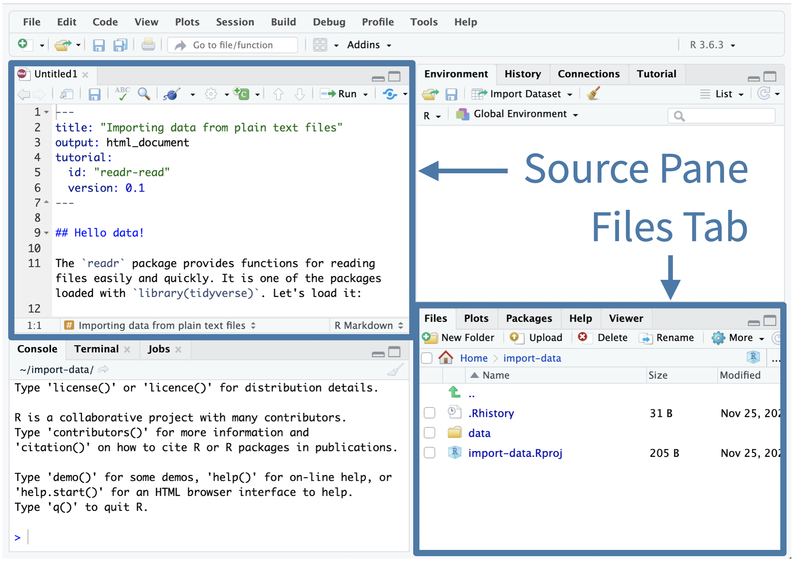

<link rel="stylesheet" type="text/css" href="https://rsacdn.link/teachthis/css/style.css"/>

```{r setup, include=FALSE}
library(learnr)
library(tidyverse)
library(arthistory)
library(ggplot2)
library(ggcheck)
library(gt)
library(ggthemes)
library(tidyr)
library(knitr)
library(tblcheck)
tutorial_options(exercise.completion = FALSE)
library(gradethis)
#opts_chunk$set(echo = knitr::is_html_output())

#knitr::opts_chunk$set(echo = FALSE, exercise.checker = gradethis::grade_learnr)
#gradethis::gradethis_setup()

gradethis_setup(
  fail.hint = TRUE,      # Give a code feedback hint on all fail*()? Remove if not desired
  fail.encourage = TRUE, # Encourage on all fail*()
  pass.praise = TRUE,    # Praise on all pass*()
  # All hints start on a new line, except for the default fail() message
  maybe_code_feedback.before = "\n\n",
  fail = "Incorrect.{maybe_code_feedback(before = ' ')} {random_encouragement()}"
)

#theme_set(theme_light())

# small data set to use throughout the tutorial
set.seed(100)
worksgardner_sample <- worksgardner %>%
 count(publication_year, artist_race,  artist_gender) %>%
 select(publication_year, artist_race,  artist_gender,n) %>%
 rename(number_of_artworks = n)

artist_book_counts <- artists %>%
    group_by(year, book) %>%              # Group data by publication year
    summarise(artist_count = n_distinct(artist_name)) 


worksgardner_sample_mutate <- worksgardner %>%
 filter(artist_race == "Black or African American")

artists_sample_mutate <-  artists %>% filter(artist_race_nwi == "Non-White") %>% select(artist_name, year, book, artist_race, artist_ethnicity, artist_gender)

set.seed(333)
a <- abs(rnorm(n = 10) * 10)
b <- a + rnorm(n = 10)

flair_bg_blue <- "#C2D8EE"
flair_bg_green <- "#DFF0D8"


```

## Introduction

### **Welcome BWD Summit 2024!**

#### Pre-Survey WorkShop Intake Form

If everyone can scan this QR code and fill out the survey

{width="140"}

#### Course Materials

To access the contents for this workshop, please go to:

<font size=5><https://pos.it/bwd24-introR>**X**</font>

### Workshop Overview

This workshop will introduce you to the fundamentals of **R language** and the Tidyverse, a powerful collection of R packages for data manipulation and visualization.

Participants will gain hands-on experience selecting and filtering data, creating new variables, and visualizing trends in the dataset. By the end of the session, they will have built several visualizations, including bar plots and line graphs, highlighting the contributions of Black women artists featured in art history textbooks.

You don’t need to know anything about R before you begin. The tutorial is designed to be the ideal starting place for new R users.

**Objectives:**

-   Teach the basics of running R code.

-   Introduce the tidyverse, focusing on `dplyr` for data manipulation.

-   Demonstrate how to create visualizations using `ggplot2`.

-   Explore the representation of Black women artists using the `worksgardner` dataset.

### Agenda

**Welcome to R:**

1.  **What is R?** (30 minutes)

    -   Write and run R code

    -   Run functions on values

    -   Save values as objects to use later with `<-`

    -   Chain functions together with `%>%`

    -   The basics of R packages

**Introduction to the Tidyverse**:

2.  **Data Manipulation with dplyr** (30 minutes)

    -   Selecting columns with `select()`.

    -   Filtering rows with `filter()`.

    -   Arranging data with `arrange()`.

    -   Creating new columns with `mutate()`.

3.  **Data Visualization with ggplot2** (30 minutes)

    -   Creating basic visualizations.

    -   Customizing plots.

    -   Visualizing trends in the data.

    -   Highlighting Black women artists.

## Logistics

**Before we begin**

Throughout this tutorial, you will see code exercises that look like this:


-   When you click **Run Code**, the box will send what you wrote to an R interpreter. That’s a program that can read and run R code. The interpreter will print the result of your code below the box.

-   When you click **Submit Answer**, it will provide feedback on your code. There is no answer being submitted, and I am not grading your submission. **Submit Answer** is a way to learn new things, like how to fix your code when it is not working

-   When you click **Solution**, it will give you the answer - as tempting as it may be - try to figure it out first before clicking on it.

## **Welcome to R**

### **What is R?**

R is a powerful and flexible programming language and software environment specifically designed for statistical computing and data analysis. R is open-source, meaning that it is free to use and has a large community contributing to its ongoing development.

### **Functions**

#### 

`Sys.Date` is an R function that returns today's date. To run it, type a pair of parentheses, `()`, after its name.

**Add a pair of parentheses behind `Sys.Date`, like this: `Sys.Date()`.** Then run the code.

```{r sysdate, exercise = TRUE, exercise.eval = TRUE}
Sys.Date
```

```{r sysdate-solution}
Sys.Date()
```

```{r sysdate-check}
grade_result(
  pass_if(~is(.result, "Date"), "When we add the parentheses, R runs the code in `Sys.Date()` and returns its result."),
  fail_if(~TRUE, "Double check that you added parentheses behind `Sys.Date`.")
)
```

#### `()`

To run any function in R, add a pair of parentheses, `()`, to the end of the function name. Think of the parentheses as the trigger that causes R to run the code stored in the function.

Sometimes you will hear people speak of *executing* a function or *calling* a function. These are synonyms for running a function.

::: tip
When I mention a function, I'll try to put `()` after its name, e.g. `Sys.Date()`. This convention will help distinguish functions from other objects in R that aren't functions. We will learn about other types of objects in future tutorials.
:::

#### 

Functions are like the "verbs" of R. Whenever we do something in R, we do it by calling a function.

R comes with thousands of predefined functions for you to use. For example, `sqrt()` computes the square root of a number.

```{r}
sqrt(3)
```

```{r sqrt, echo = FALSE}
question(
  "Make a guess. What will R return if we run `sqrt()` with no `3` between the parentheses?",
  answer("An error", correct = TRUE, "Many functions, like `sqrt()` require input to do their job. We must tell R which number to take the square root of."),
  answer("Some code", message = "R would return some code if we ran `sqrt` without the parentheses."),
  answer("1.732051"),
  answer("NA", message = "R uses the symbol NA to stand for data that is _not available_, i.e. missing. The result of `sqrt()` is not available, but it is not available due to user error."),
  allow_retry = TRUE
)
```

### **Objects**

#### **Consider this**

-   How would *you* store this number `2.718282` as `e` in R's memory?
-   How would you retrieve the value of `e`?

#### **Assignment**

To save `2.718282` as `e` in R, we assign the value `2.718282` to the name `e`. The syntax looks like this:

```{r assign-e}
e <- 2.718282
```

```{r ref.label="assign-e"}
# show `assign-e` chunk in text
```

`<-` is R's assignment operator. To write it, type:

1.  a less than sign, `<`, followed immediately by
2.  a minus sign, `-`

The combination looks like an arrow. `<-` creates a new *object* that has the name that appears on the left side of the arrow and the value that appears on the right side of the arrow.

::: tip
There is a programming paradigm called Object Oriented Programming (OOP) —- that's not R, and I'm not using the term "object" in the same way. Here, object means something much closer to its meaning in English. Think of an "object" as the implied entity that has the name `e` and (for the moment) the value `r e`.
:::

### 

Code that uses `<-` does not return a result for us to see, but it does create a change that we can use. Now, whenever we call `e` in our code, R will replace it with the value `2.718282`.

```{r}
1 + e
```

\

```{r}
e^10
```

\

```{r}
2 * e
```

### 

Let's make our own version of `e`.

**Create an object named `e` for yourself below.** I've typed out the value of $e$ to get you started. Remember that R won't return a result when you create an object, and that's OK.

```{r makee, exercise = TRUE}
2.718282
```

```{r makee-solution}
e <- 2.718282
```

```{r makee-check}
grade_this_code("Good work. Now let's look at what we can do with `e`")
```

### What if?

We can assign to an object more than once.

```{r eval = FALSE}
q <- 55
q <- 99
q
```

```{r mwr-mcq6, echo = FALSE}
learnr::question("Make a guess. What will `q` return when we run this code?",
  answer("`55`, because this was the first value we assigned to `q`."),
  answer("`99`, because this was the most recent value we assigned to `q`.", correct = TRUE),
  answer("`55, 99`, because R is starting a collection of values stored in `q`."),
  answer("Actually, this code won't get to `q`, because R will return an error when we try to run `q <- 99`.", message = "Thankfully, R will not return an error."),
  allow_retry = TRUE,
  correct = "
We can update the value of an object by reassigning to it.
This is very practical, but it has a downside:
it is easy to overwrite the values of existing objects. Be careful!"
)
```

### **Functions and objects**

#### 

Can you run a function on an object? Let's find out. **In the box below, try to `round()e`.**

```{r rounde, exercise = TRUE, exercise.setup="assign-e"}

```

```{r rounde-solution}
round(e)
```

```{r rounde-check}
grade_this_code("Excellent, you can run a function on an object. And `round(e)` was less typing than `round(2.718282)`.")
```

#### 

### **Naming rules**

#### 

We can name an object almost anything we want, but we do need to follow a couple of rules:

1.  A name cannot begin with a number
2.  A name cannot contain a special character like, `+`, `-`, `/`, `*`, `^`, `%`, `!`, `$`, `@`, `'`, `"`. R wouldn't be able to tell if we were naming an object or doing some math. One exception is `_`, which is often used *in* names (but a name can't start with `_`).

#### 

### **Assembling code**

#### 

**On the three empty lines below:**

1.  Create an object named `hello` that contains the value `56`
2.  Create an object named `world` that contains the value `44`
3.  Add `hello` to `world`

```{r hello, exercise = TRUE, exercise.lines = 3}
 
 

```

```{r hello-solution}
hello <- 56
world <- 44
hello + world
```

```{r hello-check}
grade_result(
  fail_if(~!exists("hello"), "Did you create an object named `hello` with `<-` ?"),
  fail_if(~!exists("world"), "Did you create an object named `world` with `<-` ?"), 
  fail_if(~!identical(hello, 56), "`hello` should have the value 56."),
  fail_if(~!identical(world, 44), "`world` should have the value 44."),
  fail_if(~!identical(.result, 100), "The result is not 100. Did you add `hello` and `world` together?"),
  pass_if(~TRUE)
)
```

### 

**Now add a function to the third line to find the square root of `hello + world`.** Be sure to remove `___` before you run your code.

```{r squarehello, exercise = TRUE}
hello <- 56
world <- 44
___(hello + world)
```

```{r squarehello-solution}
hello <- 56
world <- 44
sqrt(hello + world)
```

```{r squarehello-check}
grade_this_code("Good job. When you write code inside of the parentheses that follow a function, R will work from the inside out: R will run the code inside of the parentheses, and then run the function outside of the parentheses on the result.")
```

### **Chaining functions**

R users will usually rewrite nested functions as *chained* functions, which are easier to read. You can chain two functions together with the pipe symbol, which looks like this, `%>%`.

```{r}
e %>% round()
```

`%>%` takes the result of the expression on its left-hand side and passes it into the first argument of the function on its right-hand side.

#### 

You can use `%>%` sequentially to chain together multiple functions. For example, we can rewrite `sqrt(round(e))` as

```{r}
e %>% 
  round() %>% 
  sqrt()
```

::: fyi
Notice that the R interpreter runs the code above as a single expression, even though it spans multiple lines. As the interpreter reads code, when it gets to the end of a line, it checks to see whether or not it has read a complete expression. If it has, the interpreter runs the code. If it hasn't, the interpreter continues to read in the next line of code. If there is no next line, the interpreter will return an error.
:::

#### `%>%` vs. `|>` {.tip}

One last detail before we wrap up---R has introduced `|>`, but for this tutorial, we are using the pipe operator named `%>%`. If you have written (or read) R code before, the `%>%` operator may look familiar to you. It works in almost exactly the same way as `|>`.

If you're curious to learn more, you can read about the differences between `|>` and `%>%` in [this blog post](https://www.tidyverse.org/blog/2023/04/base-vs-magrittr-pipe/){target="_blank" rel="noopener noreferrer"}.

#### 

Congrats on completing your intro to R coding. Now lets dive into the Tidyverse World :)

## **Introduction to Tidyverse**

{width="124"}

### Overview

The `tidyverse` is a [**collection of R packages**](https://www.tidyverse.org/packages) designed for data science. All packages share an underlying design philosophy, grammar, and data structures. It includes packages like **ggplot2** for visualization, **dplyr (**pronounced **DEE-ply-er)** for data manipulation, and **tidyr** for data tidying.

As of [tidyverse 2.0.0](https://www.tidyverse.org/blog/2023/03/tidyverse-2-0-0/), the core tidyverse includes nine packages:

-   **ggplot2**
-   **dplyr**
-   tidyr
-   readr
-   purrr
-   **tibble**
-   stringr
-   forcats
-   lubridate

## **Tables / Tibbles / data frames**

In R, spreadsheet-like tables are called "tibbles" or "data frames."

A data frame is a rectangular collection of variables (in the columns) and observations (in the rows).


As data scientists, we will work closely with tibbles. Today we will learn how to transform and visualize data from tibbles.

## **Introducing the Data**

Art history textbooks may be filled with art, but women artists frequently occupy less space. The insights we can gain from data are profound, revealing truths that often go unnoticed.

+--------------------------------------------+------------------------------------------------------------------------------------------+
| {width="85%"} | #### **"I paint what I am. I am a black woman, and I am proud of being a black woman."** |
|                                            |                                                                                          |
|                                            | #### **Faith Ringgold** \|                                                               |
+--------------------------------------------+------------------------------------------------------------------------------------------+

### **Art History Textbooks**

The data that will be used in this tutorial comes from the [arthistory data package](https://saralemus7.github.io/arthistory/)

This dataset contains data that was used for Holland Stam’s thesis work, titled [Quantifying art historical narratives](https://research.repository.duke.edu/concern/datasets/q811kk70n?locale=en). The data was collected to assess the demographic representation of artists through editions of Janson’s History of Art and Gardner’s Art Through the Ages, two of the most popular art history textbooks used in the American education system. In this package specifically, both artist-level and work-level data was collected along with variables regarding the artists’ demographics and numeric metrics for describing how much space they or their work took up in each edition of each textbook.

This package contains three datasets:

-   `worksjanson`: Contains individual work-level data by edition of Janson's art history textbook from 1963 until 2011. For each work, there is information about the size of the work and text as displayed in the textbook as well as details about the work’s medium and year created. Demographic data about the artist is also included.

-   `worksgardner`: Contains individual work-level data by edition of Gardner’s art history textbook from 1926 until 2020. For each work, there is information about the size of the work as displayed in the textbook as well as the size of the accompanying descriptive text. Demographic data about the artist is also included.

-   `artists`: Contains various information about artists by edition of Gardner or Janson’s art history textbook from 1926 until 2020. Data includes demographic information, space occupied in the textbook, as well as presence in the MoMA and Whitney museums.

**Let’s start by reading in the data**:

R doesn't use every package you have installed every time you open R. R waits for you to tell it which packages you would like to use during *that* R session. By R session, I mean the time from when you open R (or the RStudio IDE) until when you close it.

::: tip
How do you tell R to load a package? With the `library()` command
:::

**Let's load the `arthistory` package below.**

```{r library-tidyverse-arthistory, exercise=TRUE}
library(arthistory)

```

```{r library-tidyverse-arthistory-solution}
library(arthistory)
```

```{r library-tidyverse-arthistory-check}
grade_this_code("The arthistory package contains 3 datasets: worksjanson, worksgardner, and artists. But for this tutorial - we are only focusing on worksgardner")
```

**Use the code box below to display `worksgardner`.**

```{r worksgardner-see, exercise=TRUE}
worksgardner
```

**Use the code box below to display all the column names in `worksgardner`.**

```{r worksgardner-col, exercise = TRUE}
colnames(worksgardner)
```

## **Data transformation with dplyr**

{width="71" height="81"}

Now it's time to transform your data and get some initial insight into the dataset.

You'll be using four dplyr *verbs* to further explore the dataset.

The four verbs are `select()`, `filter()`, `arrange()` and `mutate()`, which do exactly what they say.

By the end of this section, you'll be comfortable using these verbs in various combinations.

## **Select Data**

### **Select, rename, and reorder columns**

This section will focus on dplyr’s `select()` function, which lets us select columns from a table. You will:

1.  Narrow a data set to only the columns that interest you
2.  Use selection helpers to select columns more easily
3.  Rename and reorder columns

#### **Select a subset of columns**

Lets take a look at the same data set again, but this time lets run `glimpse()`.

```{r ex-select-column, exercise=TRUE}
glimpse(worksgardner)

```

##### **`select()`**

**Fill in the blank code below with `select()` to select four columns from `worksgardner`.**

```{r dplyr-arthistory-select-1, exercise=TRUE}
worksgardner %>%
  ____(artist_name, artist_gender, artist_race, publication_year)
```

```{r dplyr-arthistory-select-1-solution}
# filter the data by "artist_race" that is "Black or African American"
worksgardner %>%
 select(artist_name, artist_gender, artist_race, publication_year) 
```

```{r dplyr-arthistory-select-1-check}
grade_this({
  pass_if_equal(
    message = "`select()` extracts columns from a data frame and returns them as a new data frame. <br> <br> 
    <p> <code>select()</code> needs two things to do its job:
      <ol>
        <li> A data set </li>
        <li> The column or columns to select </li>
      </ol>
    </p>
    "
  )
  fail()
})

```

```{r new-df, echo = FALSE}
learnr::question("Does `select()` alter the original data set?",
  answer("Yes", correct = FALSE), 
  answer("No", correct = TRUE),
  incorrect = "Sorry - `worksgardner` still has the original data.",
  correct = "`select()` does not alter the original data frame. `select()` returns its results as _new_ data frame for us to save.",
  allow_retry = TRUE,
  random_answer_order = TRUE
)
```

### **By name**

As you saw earlier, it is common to select columns by name. Try it below.

**Use `select()` to return all of the following columns from `worksgardner`.**

1.  `artist_name`
2.  `artist_race`
3.  `space_ratio_per_page`
4.  `publication_year`

```{r selectByName, exercise = TRUE}

```

```{r selectByName-solution}
worksgardner %>%
  select(artist_name, artist_race, space_ratio_per_page, publication_year)
```

```{r selectByName-check}
grade_this({
  pass_if_equal()
  fail()
})
```

### **Names with backticks**

Recall what you know about object names in R.

```{r parse, echo = FALSE}
learnr::question("Which of the following column names would be difficult for R to parse as they are?",
  answer("`studyName`", correct = FALSE),
  answer("`Body Mass (g)`", correct = TRUE), 
  answer("`Delta 15 N (o/oo)`", correct = TRUE),
  answer("`Clutch Completion`", correct = TRUE),
  correct = "If a column name contains characters that aren't usually allowed as an object name (e.g. contains spaces, begins with a number, or contains an unusual symbol), we need to wrap it in backticks (`` ` ``) like this: `` `Clutch Completion` `` when we refer to it in R. This prevents R from misinterpreting the column name.",
  allow_retry = TRUE,
  random_answer_order = TRUE
)
```

::: fyi
Some R functions allow you to specify such invalid names in quotes, e.g. `"Clutch Completion"`. However, this is inconsistent. Backticks work generally across R to refer to these types of names, so we recommend using them over other options.
:::

### **Takeaway** {.takeaway}

-   You can use the `select()` function from dplyr to subset columns from a data frame by name with the pattern:

    ```{r, eval = FALSE, echo = TRUE}
    <DATA SET> %>%
      select(<COLUMN1>, <COLUMN2>)
    ```

-   To select a column whose name looks like

    -   a number, `2012`,
    -   a mathematical expression, `A-1`,
    -   or two object names, `Art Work`,

    we need to wrap it in backticks when we refer to it in `select()`. This prevents R from misinterpreting the column name, e.g.

    ```{r eval = FALSE,echo=TRUE}
    select(worksgardner, `Art Work`)
    ```

### **Rename columns**

There’s another useful way to use `select()`. **Run the code and see.**

```{r dplyr-arthistory-select-4, exercise=TRUE}
worksgardner %>%
  select(`Artist Name` = artist_name)
```

##### **`rename()`**

If you only need to rename columns without subsetting them from the data set, it is preferable to use dplyr’s rename() function instead.

Run the code below which uses rename(). What is the difference between using rename() or select()?

```{r dplyr-arthistory-select-5, exercise=TRUE}
worksgardner %>%
  rename(`Artist Name` =  artist_name)
```

### **Relocate**

`relocate()` is used to reorder columns in your data frame. By default it puts whatever columns you list at the front of your data set.

**Let's try to relocate `artist_gender` and `artist_race` as the first two columns in the window below.**

```{r dplyr-arthistory-select-6, exercise=TRUE}
worksgardner %>%
  relocate('___','___')
```

```{r dplyr-arthistory-select-6-solution}
# relocate "artist_race" that is "Black or African American"
worksgardner %>%
relocate('artist_gender','artist_race')
```

```{r dplyr-arthistory-select-6-check}
grade_code("relocate() reorder the columns in your data frame.")
```

You can determine where to relocate the columns with the optional arguments `.before` or `.after`.

```{r dplyr-arthistory-select-7, exercise=TRUE}
worksgardner %>%
  relocate(artist_gender,artist_race, .after = artist_name)

```

### **Takeaway** {.takeaway}

-   To select and rename columns in single step, use `select(<NEW NAME> = <OLD NAME>)`
-   To rename existing columns without dropping the rest of the columns in the data set, use `rename(<NEW NAME> = <OLD NAME>)`
-   To reorder columns use `relocate()`. Use the arguments `.before` or `.after` to specify where columns should be relocated.

## **Filter Data**

### **Filter rows from a table**

In this section you will subset rows from a data set. Specifically, you will learn how to:

1.  Subset a table to just the rows that interest you with `filter()`

2.  Write logical tests within `filter()` to determine which rows to return

Let's say that you wanted to choose a particular set of observations, i.e. - those for which the "artist_race" was 'Black or African American'. dplyr allows us to do intuitively and in a language that mirrors how you think and talk about data.

You can use `filter()` from the dplyr package to return only rows where `artist_race` corresponds to "Black or African American".

**Fill in the blank with filter() below**.

```{r dplyr-arthistory-filter, exercise=TRUE}
worksgardner %>%
  ___(artist_race == "Black or African American")
```

```{r dplyr-arthistory-filter-solution}
worksgardner %>%
  filter(artist_race == "Black or African American")
```

```{r dplyr-arthistory-filter-check}
grade_this({
  pass_if_equal(
    message = "Let's take a closer look at what arguments we pass to `filter()`."
  )
  fail()
})

```

### **Using `filter()`**

`filter()` needs two things to do its job:

::: {#filterblock style="background-color: #f0f0f0; padding: 10px; border-radius: 5px;"}
**worksgardner %\>%**

**filter(artist_race == "Black or African American")**
:::

1.  A data set to filter (this is often supplied by the forward-pipe operator, but it doesn’t have to be).

2.  A logical test to use as filtering criteria. Within that test, we can refer to columns in the data set by name.

`filter()` will return every row in the data set where the result of the logical test is `TRUE`.

Try it below. **Use `filter()` to find the rows in `worksgardner` where the `publication_year` is greater than or equal to `2000`.**

```{r dplyr-arthistory-filter-2, exercise=TRUE}

```

```{r dplyr-arthistory-filter-2-solution}
worksgardner %>%
  filter(publication_year  >= 2000) 
```

```{r dplyr-arthistory-filter-2-check}
grade_this({
  pass_if_equal()
  fail()
})

```

### **Takeaway** {.takeaway}

You can use `filter()` to find and return specific rows from a data frame, with the following syntax:

```{r syntax-show, eval = FALSE, echo=TRUE}
filter(<DATA SET>, <LOGICAL TEST>)
```

-   Using dplyr functions does not modify the original data set. To save your results, you must assign your table to a new R object.

-   Avoid common mistakes when writing logical tests with `filter()`:

    1.  **Do not** use `=` instead of `==` to test for equality

    2.  **Do not** forget to surround strings with quotation marks. Write `artist_gender == "Female"`, instead of `artist_gender == Female`.

::: fyi
Like all dplyr functions, you don't have to use the forward-pipe operator to supply the first argument:

```{r dplyr-filter-solution-no-pipe, eval = FALSE, echo=TRUE}
filter(worksgardner, artist_gender == "Female")
```
:::

### `filter()` and Boolean operators

Use Boolean operators to filter the `worksgardner` data set to show only data that meet all of the following criteria:

1.  The artist race is "Black or African American"
2.  The artist gender is Female
3.  The publication year is less than 2003

```{r Boolean-filter, exercise = TRUE}
worksgardner %>% 
  filter(____)
```

```{r Boolean-filter-solution}
worksgardner %>% 
  filter(artist_race == "Black or African American" & artist_gender == "Female" & publication_year < 2003)
```

```{r Boolean-filter-check}
grade_this({
  pass_if_equal()
  fail()
})
```

## **Arrange Data**

### Arranging data with `arrange()`

The arrange() function allows you to sort your data based on the column(s) of your choice.

For example: What year did black women artwork get featured in the Gardner textbook?

We can use the `arrange()` function from the dplyr package to find out. **Run the code below.**

```{r arr, exercise = TRUE}
worksgardner %>% 
  filter(artist_gender == "Female", artist_race == "Black or African American") %>% 
  select(artist_name, publication_year, title_of_work) %>%
  arrange(publication_year)
```

```{r aq3, echo = FALSE}
learnr::question(
  "What does `arrange()` do?",
  answer("`arrange()` sorts the rows according to the values of a column.", correct = TRUE),
  answer("`arrange()` moves a column to the right-hand side of the data set."),
  answer("`arrange()` moves a column to the left-hand side of data set."),
  allow_retry = TRUE
)
```

### **`desc()`**

To arrange rows from highest value to lowest (*descending* order), surround a column name with `desc()`. Like `arrange()`, `desc()` comes with the dplyr package.

For example, which black female artist had the *greatest* `space_ratio_per_page` in the data set?

```{r desc1, exercise = TRUE}
worksgardner %>% 
  filter(artist_gender == "Female", artist_race == "Black or African American") %>% 
  select(artist_name,publication_year,space_ratio_per_page) %>%
  arrange(desc(space_ratio_per_page))
```

We can use `arrange()` and `desc()` to sort any type of column in R. For example, we can sort a character column. `arrange()` and `desc()` will sort the column in alphabetical order. `desc()` will change this to reverse alphabetical order.

**Use `arrange()` and `desc()` to create this table.** 
Hint: Return only select fields but replace `select` with `distinct`.

```{r echo = FALSE}
worksgardner %>% 
  filter(artist_gender == "Female") %>% 
  distinct(publication_year, artist_race, artist_gender) %>%
  arrange(artist_race, desc(publication_year))
```

```{r test, exercise = TRUE}

```

```{r test-solution}
worksgardner %>% 
  filter(artist_gender == "Female") %>% 
  distinct(publication_year, artist_race, artist_gender) %>%
  arrange(artist_race, desc(publication_year))
```

```{r test-check}
grade_this_table("When we use `desc()`, we must wrap each column in its own `desc()` statement—or not. This gives us the flexibility to sort by descending values of one column and ascending values of another.")
```

### **Takeaways** {.takeaway}

Use `desc()` inside `arrange()` to arrange by a variable in descending order. For example, the following code would arrange `worksgardner` by descending `publication_year`:

```{r eval=FALSE, echo=TRUE}
worksgardner %>% 
  arrange(desc(publication_year))
```

## **Mutate Data**

### **Create new columns**

In this lesson you will create and modify the columns in a table using the `mutate()` function from the dplyr package. `mutate()` is one of the most useful functions to have in your data science toolkit.

Specifically, you will learn how to:

1.  Add new columns

2.  Update existing columns

### **Add a new column**

Consider a small data set I’ve prepared called `artists_sample_mutate`. It has six columns.

```{r}
artists_sample_mutate
```

We want to add a seventh column called `is_female`, which will be a logical column (`TRUE` or `FALSE`) indicating whether the artist's gender is female:

We can use dplyr’s `mutate()` function to add new columns. Try it—**fill in the blank with `mutate()` to add the `is_female` column.**

```{r ex-mutate-data, exercise=TRUE}
artists_sample_mutate %>%
  ____(is_female = artist_gender == "female")
```

```{r ex-mutate-data-solution}
artists_sample_mutate %>%
  mutate(is_female = artist_gender == "female")
```

```{r ex-mutate-data-check}
grade_this_code("mutate() is used to add new columns")
```

### **Syntax**

Whenever we use `mutate()`, we follow a specific pattern to create a new column:

```         
<data set> %>%
  mutate(<new_column> = <contents of new column>)
```

We supply:

-   **data set**: the name of the data set you are starting with is always the first argument of `mutate()`. This is often supplied using the forward-pipe operator.

-   **name of the new column**: this is `is_female` in the previous example.

-   **contents of the new column**: this is the vector checking to see if a value exists for `artist_gender` and when the condition is met, setting the value to `TRUE`.

Here is our code again:

```         

artists_sample_mutate %>%
  mutate(is_female = artist_gender == "female")
```

::: fyi
You can also use `mutate()` without the forward pipe operator:

```{r no-pipe-example, eval = FALSE}
mutate(<data set>, <new_column> = <contents of new column>)
```
:::

### Takeaway {.takeaway}

You've now learned how to use dplyr's `mutate()` to:

-   Update an existing column
-   Create columns efficiently by computing multiple columns in a single `mutate()` call

## **Visualization with ggplot2**

{width="81"}

**What is ggplot2?**

-   A powerful R package for creating visualizations.

-   Part of the Tidyverse collection.

**Why use ggplot2?**

-   Allows flexible, layered graphics and aesthetic customization.

-   Used to create both simple and complex visualizations.

::: tip
**It’s easier to learn from something that we can see rather than read**.
:::

**In this section, you’ll learn**:

1.  The Grammar of Graphics

2.  Add Layers with Geoms

3.  **Exercise**: Plot a basic bar chart and add on.

**Let's Begin.**

### 

### **Understanding ggplot2 Syntax**

The `ggplot2` package allows you to create data visualizations based on the grammar of graphics (”gg” in ggplot comes from: grammar of graphics. )

-   **The basic syntax** of ggplot2 begins with the **`ggplot()`** function, where you specify the dataset and, optionally, the aesthetic mappings, such as **`aes(x = variable1, y = variable2)`**.

-   **Layers** are then added via **`+`** to include points (as in scatter plots), lines, or bars. For a bar plot, we are going to use the **`geom_col()`** function, where the height of the bars is determined by a value in the data.

Here's a concise example using the **`artist_book_counts`** data frame:

```{r ggplot1, eval=FALSE, echo=TRUE}


ggplot(data = <DATA>, mapping = aes(x = <VARIABLE1>, y = <VARIABLE2>)) + 
  geom_*()

ggplot(artist_book_counts, aes(x = year, y = artist_count)) + 
  geom_col()

```

### **Building a Basic Bar Plot**

Let's construct a basic bar plot step by step, focusing on the **`artist_book_count`** dataset.

1.  **Load** your dataset.

2.  **Select variables** for the x and y axes. Consider what you're trying to analyze; for instance,establishing the relationship between Gardner's publication year and the number of artists.

3.  **Generate the plot** using ggplot2's syntax. Here's how you can do it:

```{r ggplot-worksgardner,  exercise=TRUE}
artist_book_counts %>%
     filter(book == "Gardner") %>%            # Filter for Gardner's book
     ggplot(aes(x = as.factor(year), y = as.factor(artist_count))) +  # Plot data 
     geom_col() 


```

::: tip
In R, `as.factor()` is a function used to convert a variable (such as a numeric or character vector) into a factor. A factor is a data type in R specifically designed to handle categorical data, which consists of a set of predefined levels (categories or groups). Factors are useful for statistical modeling, data analysis, and plotting, as they represent categories in a structured way.
:::

### **Customizing Aesthetics**

The true power of ggplot2 lies in its ability to customize and enhance visual aesthetics, making your plots not only informative but visually engaging. Here's how you can elevate your plots:

**Color and Fill**:

`fill`: Controls the fill color of the bars.

-   Used to color the inside of the bars based on a variable.
-   Commonly used for distinguishing categories or groups within the bars.

```{r ggplot-aes-1, eval=FALSE, echo=TRUE}
ggplot(data, aes(x = category, y = value, fill = group)) +
  geom_col()

```

```{r ggplot-aes-book-sidebyside1, eval=TRUE, exercise=TRUE}

# Side-by-side columns for different books
artist_book_counts %>%
  ggplot(aes(x = as.factor(year), y = artist_count, fill = book)) +  # Plot data with fill
  geom_col(position = position_dodge())

```

::: tip
`position_dodge()` is used to adjust the position of graphical elements when they are plotted side by side. It is commonly used with grouped or stacked bar charts or other elements that involve multiple categories or groups.

When you use `geom_col()` (or `geom_bar()`) with position = `position_dodge()`, it ensures that the bars representing different groups (in this case, the "`book`" variable) are placed side by side instead of being stacked on top of each other.

**Experiment**: Try running the above with and without `position = position_dodge()`
:::

`color`: Controls the outline color (border) of the bars.

-   Sets the color of the bar borders.

-   This can either be a single color or mapped to a variable to create outlines based on categories.

```{r ggplot-aes-2, eval=FALSE, echo=TRUE}
ggplot(data, aes(x = category, y = value, color = group)) +
  geom_col()
```

### **Enhancing Your Bar Chart with Labels and Legends**

-   Add labels to your bars
-   Customize the legend
-   Adjust the x-axis labels to avoid them being squished

**Let’s dive in!**

Adding Labels to Your Bars When visualizing data, adding labels helps make your chart more informative. We’ll use the geom_text() function to place the labels on top of each bar, showing the exact count of artists for each year.

```{r ggplot-labels, fig.width=12, fig.height=8, eval=TRUE, exercise=TRUE}

# Adding labels to the chart
artist_book_counts %>%
  ggplot(aes(x = as.factor(year), y = artist_count, fill = book)) + 
  geom_col(position = position_dodge()) +  # Side-by-side columns
  geom_text(aes(label = artist_count),      # Add labels
            position = position_dodge(width = 0.9),  # Position labels to match the bars
            vjust = -0.5)                  # Adjust the vertical position of labels


```

-   **`geom_text(aes(label = artist_count))`**: Adds the artist count as text on top of each bar.

-   **`position_dodge(width = 0.9)`**: Ensures the labels are aligned with the columns.

-   **`vjust = -0.5`**: Moves the labels slightly above the columns.

**Customizing the Legend**

By default, ggplot2 adds a legend to your chart to represent different groups (in this case, the different books). You can customize the legend’s title and its appearance for clarity.

```{r ggplot-legend, fig.width=12, fig.height=8,  eval=TRUE, exercise=TRUE}

# Customizing the legend
artist_book_counts %>%
  ggplot(aes(x = as.factor(year), y = artist_count, fill = book)) + 
  geom_col(position = position_dodge()) + 
  geom_text(aes(label = artist_count), 
            position = position_dodge(width = 0.9), 
            vjust = -0.5) +
  labs(
    title = "Artist Counts by Year and Book",     # Add a title to the plot
    x = "Year",                                  # X-axis label
    y = "Number of Distinct Artists",             # Y-axis label
    fill = "Art History Books"                    # Legend title
  )


```

-   **`labs()`**: A function to add labels to your plot. You can specify the title, axis labels, and legend title.

-   **`fill = "Art History Books"`**: Renames the legend title to something more descriptive.

#### **Adjusting the X-Axis Labels**

In the previous plot, the x-axis labels (the years) might appear squished together. To make the labels more readable, we’ll rotate them by 45 degrees using the `theme()` function.

```{r ggplot-axis-labels, fig.width=12, fig.height=8, eval=TRUE, exercise=TRUE}
# Rotating the x-axis labels
artist_book_counts %>%
  ggplot(aes(x = as.factor(year), y = artist_count, fill = book)) + 
  geom_col(position = position_dodge()) + 
  geom_text(aes(label = artist_count), 
            position = position_dodge(width = 0.9), 
            vjust = -0.5) +
  labs(
    title = "Artist Counts by Year and Book",     
    x = "Year",                                  
    y = "Number of Distinct Artists",             
    fill = "Art History Books"                    
  ) +
  theme(axis.text.x = element_text(angle = 45, hjust = 1))  # Rotate x-axis labels


```

**`theme(axis.text.x = element_text(angle = 45, hjust = 1))`**: This rotates the x-axis labels by 45 degrees and adjusts the horizontal alignment (`hjust`) to make sure the labels look neat.

### `facet_wrap()`?

`facet_wrap()` in `ggplot2` is used to split your plot into multiple smaller plots (facets), each showing a subset of the data. It's helpful when you want to compare trends or distributions across different categories. Each facet contains the same type of plot, but displays only a specific subset of the data based on a categorical variable.

#### **Example Use Case**:

Let’s say you want to compare artist counts by year for different **races**. You can use `facet_wrap()` to create a separate plot for each race.

Basic Syntax of `facet_wrap()`:

```{r ggplot-facet-echo, eval=FALSE, echo=TRUE}
ggplot(data, aes(x = x_var, y = y_var)) + 
  geom_col() + 
  facet_wrap(\~ category_var)
```

`facet_wrap(~ category_var)`: This splits the data into separate plots based on the values of category_var.

```{r ggplot-facet-chart, eval=TRUE,  fig.width=12, fig.height=8, exercise=TRUE}

ggplot(data = worksgardner) +
  geom_bar(aes(x = as.factor(publication_year), fill = artist_gender), position = "dodge") +
  labs(title = "Artworks by Publication Year, Artist Gender, and Artist Race", 
       x = "Publication Year", 
       y = "Number of Artworks") +
  theme_minimal() +
  theme(axis.text.x = element_text(angle = 45, hjust = 1)) +
  facet_wrap(~artist_race)


```

### Takeaway {.takeaway}

Until now, our template for creating plots has been:

```{r echo=FALSE, eval=TRUE}
flair::decorate("ggplot-geoms-template-1", eval = FALSE) %>% 
  flair::flair_rx("&lt;\\w+&gt;", background = flair_bg_green)
```

```{r ggplot-geoms-template-1, eval=FALSE, echo=TRUE}
ggplot(data = <DATA>, mapping = aes(x = <VARIABLE>, y = <VARIABLE>)) +
  geom_col()
```

Now, that you understand the basic syntax for `ggplot`, the geom function doesn't have to be `geom_col()`, so we can revise our template to something more general:

```{r echo=FALSE, eval=TRUE}
flair::decorate("ggplot-geoms-template-2", eval = FALSE) %>% 
  flair::flair_rx("&lt;\\w+\\s*\\w+&gt;", background = flair_bg_green)
```

```{r ggplot-geoms-template-2, eval=FALSE, echo=FALSE}
ggplot(data = <DATA>, mapping = aes(x = <VARIABLE>, y = <VARIABLE>)) +
  <GEOM FUNCTION>
```

### 

Here's a table of common geom functions:

| Geom               | Creates           | Notes          |
|--------------------|-------------------|----------------|
| `geom_bar()`       | Bars              | Only needs `x` |
| `geom_boxplot()`   | Boxplots          |                |
| `geom_col()`       | Columns           |                |
| `geom_hex()`       | Hexagonal heatmap |                |
| `geom_histogram()` | Histogram         | Only needs `x` |
| `geom_line()`      | Lines             |                |
| `geom_point()`     | Points            |                |
| `geom_smooth()`    | Smooth line       |                |

## **Visualizations from the #TidyTuesday community**

[](https://jacobjameson.com/Data/viz/2023-01-17%20Tidy%20Tuesday/TT_wk3.html)

[](https://community.storytellingwithdata.com/challenges/jul-2023-bring-on-the-bubbles/art-history-books)

[](https://hanzholahs.quarto.pub/contents/posts/0001-tidytuesday-artists/)

[](https://juliasilge.com/blog/art-history/)

## **Art Appreciation**

[](https://www.faithringgold.com/portfolio/whos-afraid-of-aunt-jemima/)

**Who’s Afraid of Aunt Jemima?, 1983**

**Faith Ringgold**

Acrylic on canvas, dyed, painted and pieced fabric\
90 x 80 in.

[](https://www.brooklynmuseum.org/opencollection/objects/147078)

**Carrie Mae Weems** (American, born 1953). *Untitled (Man Smoking/Malcolm X), from the Kitchen Table series*, 1990.

[](https://glamportal.auctr.edu/exhibits/show/dont-touch-my-hair/item/3272)

**Lorna Simpson**, Stereo Styles

## Experiment with Visualizations

```{r ggplot-experiment-test, eval=FALSE, fig.width=12, fig.height=8, exercise=TRUE}

#Replace / Modify 
#Space Ratio per page
ggplot(worksgardner, aes(x = artist_gender, y = space_ratio_per_page, color = artist_gender)) +
     geom_point(alpha = 0.7, position = position_jitter(width = 0.2)) +
     labs(title = "Artwork Space Ratio per Page by Gender",
          x = "Artist Gender",
          y = "Space Ratio per Page",
          color = "Artist Gender") +
     theme_minimal()


```

### Reflection Questions:

1.  **What can you infer about the representation of different races in the dataset based on the chart?**

2.  **Are there races with significantly more or fewer artworks compared to others?**

3.  **How does this visual representation help in understanding the diversity of artworks by race?**

## Next Steps

**Want to keep learning?**

### **DOWNLOAD RStudio Desktop**

<https://posit.co/download/rstudio-desktop/>

Used by millions of people weekly, the RStudio integrated development environment (IDE) is a set of tools built to help you be more productive with R and Python.\
\
Don’t want to download or install anything? Get started with RStudio on [[Posit Cloud for free]{.underline}](https://posit.cloud/plans?utm_source=Website&utm_medium=IDE_Download). If you're a professional data scientist looking to download RStudio and also need common enterprise features, don't hesitate to [[book a call with us]{.underline}](https://posit.co/schedule-a-call/?booking_calendar__c=RStudio_IDE).\
\
Want to learn about core or advanced workflows in RStudio? Explore the [[RStudio User Guide]{.underline}](https://docs.posit.co/ide/user/) or the [[Getting Started]{.underline}](https://docs.posit.co/ide/user/ide/get-started/) section.

### **1: Install R**

RStudio requires R 3.6.0+. Choose a version of R that matches your computer’s operating system (Windows, MacOS, or Linux) and download the appropriate installer from the Comprehensive R Archive Network (CRAN): <https://cran.r-project.org/>.\
\
*R is not a Posit product. By clicking on the link below to download and install R, you are leaving the Posit website. Posit disclaims any obligations and all liability with respect to R and the R website.*

### **2: Install RStudio**

<https://posit.co/download/rstudio-desktop/>

{width="75%"}

Once RStudio IDE and R is installed, you can start using it to run analyses and visualizations. R has a wide variety of packages available to extend its functionality. Here’s how to install and load some basic R packages:

### **Installing Packages**:

To install a package in R, use the `install.packages()` function.

For example, you can install the ggplot2 package for data visualization and the dplyr package for data manipulation:

`install.packages("ggplot2")`

`install.packages("dplyr")`

### **Loading Packages**:

After a package is installed, you need to load it into your R session using the library() function. This needs to be done each time you start a new session and want to use the package:

Example:

```{r ex12-print, exercise=FALSE}
library(ggplot2)  
library(dplyr)     
```

Conclusion: With R installed and basic packages loaded, you're ready to start performing data analysis and visualizations. R offers extensive resources and community support, making it a great choice for anyone looking to work in data science or statistics. Happy coding!

## **Additional Resources**

[Cheetsheets](https://posit.co/resources/cheatsheets/): start with dplyr and ggplot

[R for Data Science](https://r4ds.had.co.nz/): free online book with clear explanations of many tidyverse functions, the book to read on data analysis with R
